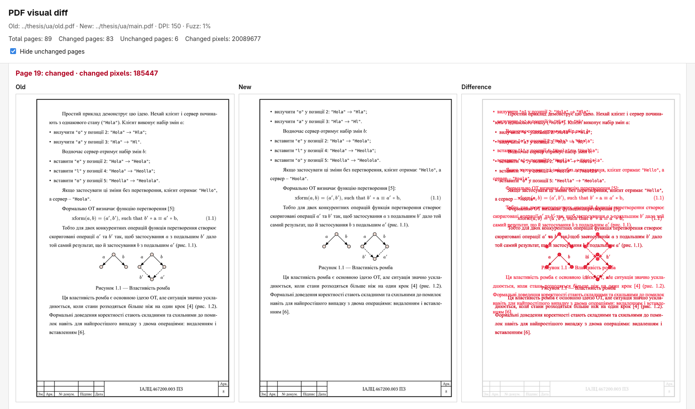

#### Mirage

[mirage_zig](./mirage_zig/) - zig implementation of CRDT. Check [README](./mirage_zig/README.md) for more info.

[js/demo](./js/demo/) - is a static website that shows basic editor functionality.

[js/mirage](./js/packages/mirage/) - is a wrapper on top of raw wasm bindings.

#### Benchmarks

Run this command from root of the repo to run the benchmarks

```bash
docker compose -f benchmark/docker-compose.yml run --rm --build crdt-benchmarks
```

<details>

<summary>Results</summary>

```text
N = 6000                                                                   | yjs              | ywasm            | automerge        |            mirage|
| :- |  -: | -: | -: | -:  |
|[B1.2] Insert string of length N (time)                                   |             2 ms |             1 ms |            39 ms |             0 ms |
|[B1.2] Insert string of length N (avgUpdateSize)                          |      6,031 bytes |      6,031 bytes |      6,201 bytes |      6,042 bytes |
|[B1.2] Insert string of length N (encodeTime)                             |             0 ms |             0 ms |             3 ms |             0 ms |
|[B1.2] Insert string of length N (docSize)                                |      6,031 bytes |      6,031 bytes |      3,974 bytes |      6,042 bytes |
|[B1.2] Insert string of length N (memUsed)                                |          39.2 kB |         324.9 kB |           2.3 kB |          42.8 kB |
|[B1.2] Insert string of length N (parseTime)                              |           111 ms |            70 ms |            57 ms |            48 ms |
|[B1.6] Insert string, then delete it (time)                               |             4 ms |             2 ms |           108 ms |             1 ms |
|[B1.6] Insert string, then delete it (avgUpdateSize)                      |      6,053 bytes |      6,053 bytes |      6,338 bytes |      6,057 bytes |
|[B1.6] Insert string, then delete it (encodeTime)                         |             2 ms |             0 ms |             8 ms |             0 ms |
|[B1.6] Insert string, then delete it (docSize)                            |         38 bytes |         38 bytes |      3,993 bytes |      6,047 bytes |
|[B1.6] Insert string, then delete it (memUsed)                            |              0 B |              0 B |           1.4 kB |              0 B |
|[B1.6] Insert string, then delete it (parseTime)                          |            70 ms |            47 ms |            89 ms |            40 ms |
|[B1.1] Append N characters (time)                                         |           458 ms |           323 ms |           628 ms |            49 ms |
|[B1.1] Append N characters (avgUpdateSize)                                |         27 bytes |         27 bytes |        121 bytes |         41 bytes |
|[B1.1] Append N characters (encodeTime)                                   |             1 ms |             1 ms |            16 ms |             1 ms |
|[B1.1] Append N characters (docSize)                                      |      6,031 bytes |      6,031 bytes |      3,992 bytes |      6,053 bytes |
|[B1.1] Append N characters (memUsed)                                      |              0 B |              0 B |              0 B |              0 B |
|[B1.1] Append N characters (parseTime)                                    |            58 ms |            46 ms |           108 ms |            43 ms |
|[B1.3] Prepend N characters (time)                                        |           364 ms |            57 ms |           576 ms |            37 ms |
|[B1.3] Prepend N characters (avgUpdateSize)                               |         27 bytes |         27 bytes |        116 bytes |         41 bytes |
|[B1.3] Prepend N characters (encodeTime)                                  |             7 ms |             1 ms |             7 ms |             1 ms |
|[B1.3] Prepend N characters (docSize)                                     |      6,041 bytes |      6,041 bytes |      3,988 bytes |      6,053 bytes |
|[B1.3] Prepend N characters (memUsed)                                     |             1 MB |           4.3 kB |           2.4 kB |              0 B |
|[B1.3] Prepend N characters (parseTime)                                   |            91 ms |            43 ms |           133 ms |            44 ms |
|[B1.4] Insert N characters at random positions (time)                     |           334 ms |           182 ms |           613 ms |            74 ms |
|[B1.4] Insert N characters at random positions (avgUpdateSize)            |         29 bytes |         29 bytes |        121 bytes |         45 bytes |
|[B1.4] Insert N characters at random positions (encodeTime)               |             2 ms |             1 ms |            21 ms |             1 ms |
|[B1.4] Insert N characters at random positions (docSize)                  |     29,554 bytes |     29,554 bytes |     24,743 bytes |     28,909 bytes |
|[B1.4] Insert N characters at random positions (memUsed)                  |         982.8 kB |              0 B |          11.3 kB |              0 B |
|[B1.4] Insert N characters at random positions (parseTime)                |           100 ms |            48 ms |           136 ms |            43 ms |
|[B1.5] Insert N words at random positions (time)                          |           376 ms |           541 ms |         1,099 ms |           128 ms |
|[B1.5] Insert N words at random positions (avgUpdateSize)                 |         36 bytes |         36 bytes |        131 bytes |         51 bytes |
|[B1.5] Insert N words at random positions (encodeTime)                    |            13 ms |             2 ms |            26 ms |             2 ms |
|[B1.5] Insert N words at random positions (docSize)                       |     87,924 bytes |     87,924 bytes |     96,203 bytes |    101,731 bytes |
|[B1.5] Insert N words at random positions (memUsed)                       |           2.1 MB |            592 B |              0 B |              0 B |
|[B1.5] Insert N words at random positions (parseTime)                     |           107 ms |            58 ms |           214 ms |            44 ms |
|[B1.7] Insert/Delete strings at random positions (time)                   |           384 ms |           229 ms |           919 ms |        25,799 ms |
|[B1.7] Insert/Delete strings at random positions (avgUpdateSize)          |         31 bytes |         31 bytes |        135 bytes |        806 bytes |
|[B1.7] Insert/Delete strings at random positions (encodeTime)             |            12 ms |             1 ms |            29 ms |             2 ms |
|[B1.7] Insert/Delete strings at random positions (docSize)                |     28,377 bytes |     28,377 bytes |     59,281 bytes |     67,553 bytes |
|[B1.7] Insert/Delete strings at random positions (memUsed)                |           1.5 MB |            352 B |              0 B |              0 B |
|[B1.7] Insert/Delete strings at random positions (parseTime)              |           123 ms |            52 ms |           168 ms |            78 ms |
|[B2.1] Concurrently insert string of length N at index 0 (time)           |             3 ms |             1 ms |           136 ms |             1 ms |
|[B2.1] Concurrently insert string of length N at index 0 (updateSize)     |      6,094 bytes |      6,094 bytes |      9,499 bytes |      6,113 bytes |
|[B2.1] Concurrently insert string of length N at index 0 (encodeTime)     |             2 ms |             0 ms |            15 ms |             0 ms |
|[B2.1] Concurrently insert string of length N at index 0 (docSize)        |     12,152 bytes |     12,152 bytes |      8,011 bytes |     12,182 bytes |
|[B2.1] Concurrently insert string of length N at index 0 (memUsed)        |              0 B |            568 B |          13.3 kB |              0 B |
|[B2.1] Concurrently insert string of length N at index 0 (parseTime)      |            60 ms |            60 ms |           112 ms |            44 ms |
|[B2.2] Concurrently insert N characters at random positions (time)        |           103 ms |           301 ms |           438 ms |           130 ms |
|[B2.2] Concurrently insert N characters at random positions (updateSize)  |     33,444 bytes |     33,444 bytes |     27,476 bytes |     30,733 bytes |
|[B2.2] Concurrently insert N characters at random positions (encodeTime)  |             2 ms |             3 ms |            19 ms |             1 ms |
|[B2.2] Concurrently insert N characters at random positions (docSize)     |     66,852 bytes |     66,860 bytes |     50,684 bytes |     61,430 bytes |
|[B2.2] Concurrently insert N characters at random positions (memUsed)     |           2.9 MB |              0 B |              0 B |              0 B |
|[B2.2] Concurrently insert N characters at random positions (parseTime)   |           101 ms |           105 ms |            80 ms |            70 ms |
|[B2.3] Concurrently insert N words at random positions (time)             |           138 ms |         1,121 ms |           809 ms |           230 ms |
|[B2.3] Concurrently insert N words at random positions (updateSize)       |     88,994 bytes |     88,994 bytes |    122,485 bytes |    101,480 bytes |
|[B2.3] Concurrently insert N words at random positions (encodeTime)       |             8 ms |             5 ms |            44 ms |             3 ms |
|[B2.3] Concurrently insert N words at random positions (docSize)          |    178,137 bytes |    178,130 bytes |    185,018 bytes |    203,331 bytes |
|[B2.3] Concurrently insert N words at random positions (memUsed)          |           6.3 MB |              0 B |          66.9 kB |              0 B |
|[B2.3] Concurrently insert N words at random positions (parseTime)        |           128 ms |           104 ms |           227 ms |            86 ms |
|[B2.4] Concurrently insert & delete (time)                                |           278 ms |         2,692 ms |         1,310 ms |           780 ms |
|[B2.4] Concurrently insert & delete (updateSize)                          |    139,517 bytes |    139,517 bytes |    298,810 bytes |    177,308 bytes |
|[B2.4] Concurrently insert & delete (encodeTime)                          |            23 ms |             9 ms |            72 ms |             8 ms |
|[B2.4] Concurrently insert & delete (docSize)                             |    279,166 bytes |    279,172 bytes |    293,831 bytes |    343,170 bytes |
|[B2.4] Concurrently insert & delete (memUsed)                             |           8.9 MB |            360 B |              0 B |              0 B |
|[B2.4] Concurrently insert & delete (parseTime)                           |           197 ms |           117 ms |           316 ms |           269 ms |
|[B3.5] 20√N clients concurrently insert text (time)                       |            73 ms |            91 ms |         3,260 ms |            37 ms |
|[B3.5] 20√N clients concurrently insert text (updateSize)                 |     48,137 bytes |     48,119 bytes |    298,020 bytes |     66,556 bytes |
|[B3.5] 20√N clients concurrently insert text (encodeTime)                 |             2 ms |             1 ms |            23 ms |             3 ms |
|[B3.5] 20√N clients concurrently insert text (docSize)                    |     24,339 bytes |     24,301 bytes |     90,791 bytes |     51,167 bytes |
|[B3.5] 20√N clients concurrently insert text (memUsed)                    |         688.5 kB |            688 B |              0 B |            168 B |
|[B3.5] 20√N clients concurrently insert text (parseTime)                  |            82 ms |            79 ms |           112 ms |           115 ms |
|[B4] Apply real-world editing dataset (time)                              |         6,971 ms |        42,634 ms |        16,452 ms |         5,198 ms |
|[B4] Apply real-world editing dataset (encodeTime)                        |            26 ms |            15 ms |           313 ms |            30 ms |
|[B4] Apply real-world editing dataset (docSize)                           |    159,929 bytes |    159,929 bytes |    129,116 bytes |    744,082 bytes |
|[B4] Apply real-world editing dataset (parseTime)                         |            70 ms |            28 ms |         2,207 ms |         2,745 ms |
|[B4] Apply real-world editing dataset (memUsed)                           |           3.2 MB |              0 B |              0 B |              0 B |
```

</details>

#### Scripts

`scripts/pdf-visual-diff.sh` shows the difference between two pdf


